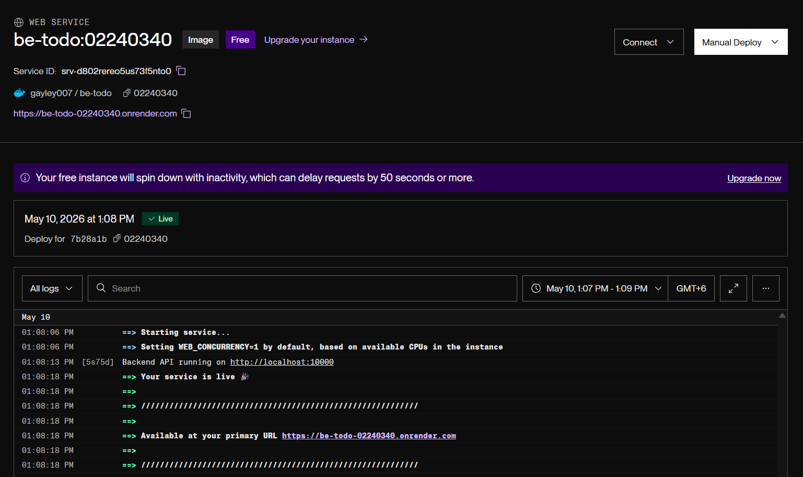
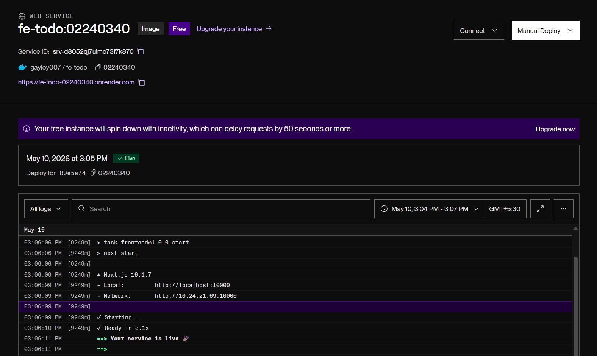
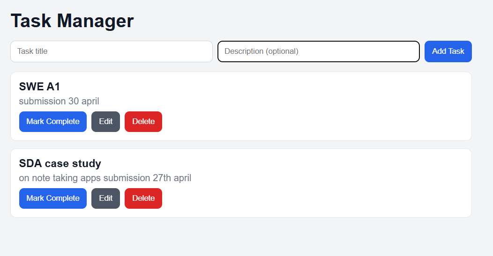

# DSO101 A1 — CI/CD Assignment Report

This project contains a simple To-Do application (frontend + backend) created for the CI/CD assignment. This README summarizes the steps I followed and commands used. 

**Assignment Summary**
- Frontend: UI to add / edit / delete tasks.
- Backend: CRUD API for tasks.
- Database: Persistence via environment-configured database (e.g., Render Postgres).

**Local testing**
- Create `.env` in `backend/` with DB credentials and `PORT` (e.g., `PORT=5000`).
- Create `.env` in `frontend/` with `REACT_APP_API_URL=http://localhost:5000` (your backend URL).
- Install and run locally to verify before containerizing.

Common local commands

```bash
# Backend 
npm install
npm start

# Frontend 
npm install
npm run dev  
```

Part A — Build and push Docker images

- Backend Dockerfile sample (used):

```dockerfile
FROM node:18-alpine
WORKDIR /app
COPY package*.json ./
RUN npm install
COPY . .
EXPOSE 5000
CMD ["node", "server.js"]
```

- Example build & push commands:

```bash
docker build -t yourdockerhub/be-todo:02190108 ./backend
docker push yourdockerhub/be-todo:02190108

docker build -t yourdockerhub/fe-todo:02190108 ./frontend
docker push yourdockerhub/fe-todo:02190108
```

Part B — Deploy on Render.com 

- Create Backend service → Select "Existing image from Docker Hub" → use `yourdockerhub/be-todo:02190108`.
- Configure environment variables on Render:
  - `DB_HOST`, `DB_USER`, `DB_PASSWORD`, `PORT=5000` (from Render Postgres dashboard)
- Create Frontend service → image `yourdockerhub/fe-todo:02190108` and set `REACT_APP_API_URL` to your backend URL.

Part C — Automated build & deploy with `render.yaml`

- I added a `render.yaml` to let Render build services from this repo on each git push. A minimal example blueprint (adjust names/paths):

```yaml
services:
  - type: web
    name: be-todo
    env: docker
    dockerfilePath: ./backend/Dockerfile
    envVars:
      - key: PORT
        value: "5000"
      - key: DB_HOST
        fromDatabase:
          name: "render-postgres-db"

  - type: web
    name: fe-todo
    env: docker
    dockerfilePath: ./frontend/Dockerfile
    envVars:
      - key: REACT_APP_API_URL
        value: "https://be-todo.onrender.com"
```

-  — screenshot of backend service on Render
-  — screenshot of frontend service on Render
-  — screenshot of simple To-Do app UI

- After pushing to GitHub, Render automatically builds and deploys both services using the `render.yaml` configuration.