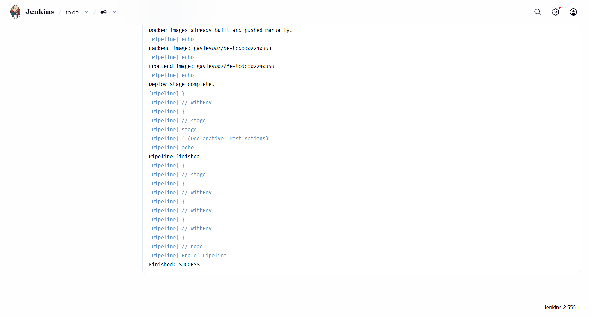
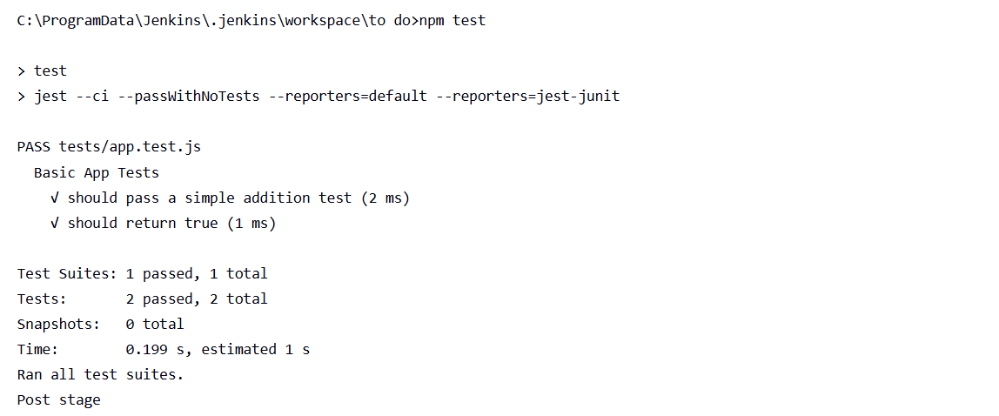
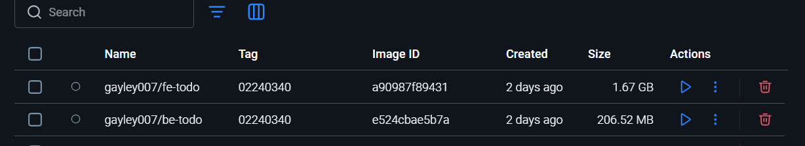

# DSO101 Assignment 2 report

This report describes CI/CD pipeline based on Jenkins that is built for the To-Do application in this repository. The purpose of the assignment was to automate code checkout, dependency installation, build validation, unit testing and deployment preparation.

## Project Overview

The application is split into two parts:

- Frontend: a Next.js application located in `frontend/`
- Backend: an Express API located in `backend/`
- Tests: a Jest test suite located in `tests/app.test.js`

The project is configured so that local testing can be done with `npm test`, which runs Jest with the `jest-junit` reporter and produces `junit.xml` for CI reporting.

## Objective

The objective of the assignment was to configure a Jenkins pipeline that performs the following stages automatically:

1. Checkout code from GitHub
2. Install Node.js dependencies
3. Build the frontend application
4. Run unit tests with Jest
5. Prepare deployment output

## Tools and Technologies

- Jenkins: pipeline orchestration and automation
- GitHub: source control and repository hosting
- Node.js and npm: runtime and package management
- Next.js: frontend framework
- Express: backend API framework
- Jest and jest-junit: unit testing and JUnit report generation

## Jenkins Pipeline Setup

The Jenkinsfile in the project root defines the pipeline. It uses the NodeJS tool installation configured in Jenkins and runs on a Windows Jenkins agent using `bat` commands.

Pipeline stages used in this project:

- Checkout: pulls the repository from GitHub
- Install: installs dependencies for the root, backend, and frontend
- Build: runs `npm run build` inside `frontend/`
- Test: runs `npm test` and generates `junit.xml`
- Deploy: prints deployment status information for the prepared Docker images

The test stage was configured to archive `junit.xml` so the Jenkins build keeps the test report output even when the dedicated `junit` step is unavailable in the server.

## Jenkinsfile Summary

The final Jenkinsfile uses these important settings:

- `nodejs 'NodeJS 22'` as the Jenkins tool
- GitHub repository checkout from the main branch
- Separate dependency installation for root, backend, and frontend packages
- Frontend production build with Next.js
- Jest execution through the root `npm test` script
- Archiving of `junit.xml` after tests

## Test Configuration

The root `package.json` contains the test script used by Jenkins:

```json
{
  "scripts": {
    "test": "jest --ci --passWithNoTests --reporters=default --reporters=jest-junit"
  }
}
```

The test file used for validation is `tests/app.test.js`:

```javascript
describe("Basic App Tests", () => {
  test("should pass a simple addition test", () => {
    expect(1 + 1).toBe(2);
  });

  test("should return true", () => {
    expect(true).toBe(true);
  });
});
```

- Local execution confirms that the suite passes and produces the expected JUnit output.

## Challenges Faced

- Jest was not initially available in the Jenkins test stage because dependencies were only being installed inside subdirectories.
- The Jenkins instance did not have the `junit` step available, so the pipeline needed to archive `junit.xml` instead of calling that step directly.
- Next.js reported multiple lockfiles in the workspace during the build, but the build still completed successfully.
- Installing Jenkins plugins was difficult due to network/permission and version issues; resolved by manually uploading .hpi files and verifying compatibility.

## Results

The pipeline successfully completed the following:

- Dependency installation
- Frontend production build
- Jest unit test execution
- JUnit report generation through `jest-junit`

 — Screenshot of Successful pipeline execution.
 — Screenshot of Test results in Jenkins.
 — Screenshot of Docker Hub image

## Conclusion

This assignment shows a working CI/CD pipeline for the To-Do application using Jenkins and GitHub. The pipeline automates the main quality checks for the project and provides a repeatable process for building and testing the code before deployment.
